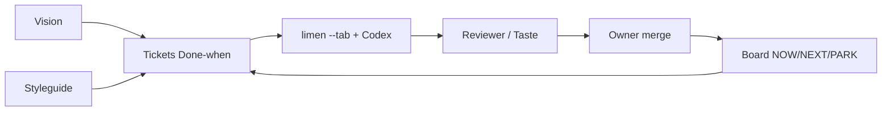

# startup-harness-codex

**For orchestrating my startup projects — I build microsaas, tools, mobile apps, etc. Optimized for highest quality, reliability, and token efficiency.**

Do orkiestracji projektów startupowych (mikrosaasy, narzędzia, apki mobilne itd.) — jakość, niezawodność i oszczędność tokenów.

Codex + Limen delivery harness: board (NOW/NEXT/PARK), vision + styleguide, ticket quality bar, orchestrate scripts. **TARGET / ~90%** spider charts are **design bars — not measured scores**.

## Get Limen

**Download Limen from:** https://mega.dev/autonomous-product-development  

You can download Limen there (and related Herdr tooling). This harness assumes `limen` / `herdr` / `gh` / Codex are available on PATH (**Mac or VPS**).

## How it works



| Piece | Role |
| --- | --- |
| **Board** | Pulls / tracks tasks — `STATUS.md`, `ACTIONS.json`, NOW / NEXT / PARK |
| **Vision** | `spec/vision.md` — product north star |
| **Styleguides** | `spec/styleguide.md` — UI/craft rules agents must follow |
| **Tickets** | Done-when + In/Out/Forbidden → limen/Codex workers → review → merge |

Full write-up: [`docs/how-it-works.md`](docs/how-it-works.md).

## Install into a project

Works on **MacBook** and **Linux VPS** (`setup.sh` detects Darwin vs Linux).

```bash
git clone https://github.com/lmiadowicz/startup-harness-codex.git
cd startup-harness-codex
bash setup.sh                         # tool checks + limen URL
bash setup.sh /path/to/your-product   # install into product repo

export PRODUCT_ROOT=/path/to/your-product
bash "$PRODUCT_ROOT/.agents/delivery/scripts/status-dump.sh"
# macOS optional:
bash "$PRODUCT_ROOT/.agents/delivery/scripts/install-launchd.sh"
# Linux/VPS: use cron or systemd — see docs/install-into-project.md
```

**What lands:** `.agents/delivery/scripts/` (orchestrate, review-and-label, status-dump, smoke, install-launchd), `PLAYBOOK.md`, `TICKET-TEMPLATE.md`, optional `board/` + `spec/vision.md` + `spec/styleguide.md` if missing.

Step-by-step: [`docs/install-into-project.md`](docs/install-into-project.md).

## Charts (design bars — not measured)

> **CRITICAL:** **TARGET 100%** is a **design bar**, **NOT** a measured score.  
> The **~90%** chart is a **harness coverage design goal / example render**, **NOT** a claimed measured score.

What traits / ORC / groups mean: [`docs/chart-traits.md`](docs/chart-traits.md).

Charts rendered with **Piotr’s mega-card** ([piotrkrych2/Random-Skills](https://github.com/piotrkrych2/Random-Skills)) — FUT card + 24-spoke spider via Chrome headless (`bash scripts/render-charts.sh` → `vendor/mega-card/render.py`).

### TARGET 100% (aspirational)


### ~90% harness coverage (honest gaps)

Honest gaps called out in the report: Context Anchoring, Evidence, Progressive Disclosure, Parallelism, Verification Closure.


### Rebuild charts

```bash
npm run charts
# or:
bash scripts/render-charts.sh
```

Needs Google Chrome / Chromium on the machine. Shell wrapper only; Python is an implementation detail of the vendored mega-card skill.

Measured example (labeled, not TARGET): [`charts/examples/pajeczyna-measured-example.png`](charts/examples/pajeczyna-measured-example.png).

## What you get

| Path | Purpose |
| --- | --- |
| `.agents/delivery/scripts/` | orchestrate / review-and-label / status-dump / smoke / install-launchd |
| `.agents/delivery/PLAYBOOK.md` | Quality bar, max 1–2 jobs, evidence |
| `.agents/delivery/TICKET-TEMPLATE.md` | In / Out / Forbidden + Done-when |
| `board/` | Sample STATUS / ACTIONS / NOW–NEXT–PARK |
| `spec/vision.md` | North star sample |
| `spec/styleguide.md` | Craft rules sample |
| `docs/limen.md` | Herdr `--tab` spawn examples (`gpt-6-astra`, thinking high) |
| `docs/codex-usage-reset.md` | When usage hits 0% → reset in Codex desktop |
| `docs/pstack.md` | Optional pstack quality-bar pointer |
| `docs/chart-traits.md` | ORC / groups / T01–T24 meanings |
| `vendor/mega-card/` | Piotr’s chart skill (attributed) |
| `setup.sh` | Primary installer (Mac + VPS) |
| `scripts/render-charts.sh` | Rebuild mega-card PNGs |

## Credits

- **Limen:** https://mega.dev/autonomous-product-development — you can download Limen there.
- **Charts / mega-card:** https://github.com/piotrkrych2/Random-Skills — credit **piotrkrych2 / mega-card**.
- **pstack (optional):** Lauren Tan / [poteto](https://x.com/poteto) style — [open-pstack](https://github.com/ericlitman/open-pstack); see `docs/pstack.md`.

See `ATTRIBUTION.md`.

## Related

- Sibling with Grok Bot token-budget rules: [`startup-harness-grok-codex`](https://github.com/lmiadowicz/startup-harness-grok-codex)

## License

Scripts and docs: use freely for your product harness. Vendored `vendor/mega-card/` retains upstream attribution. Upstream limen / pstack / Codex remain under their own terms.
